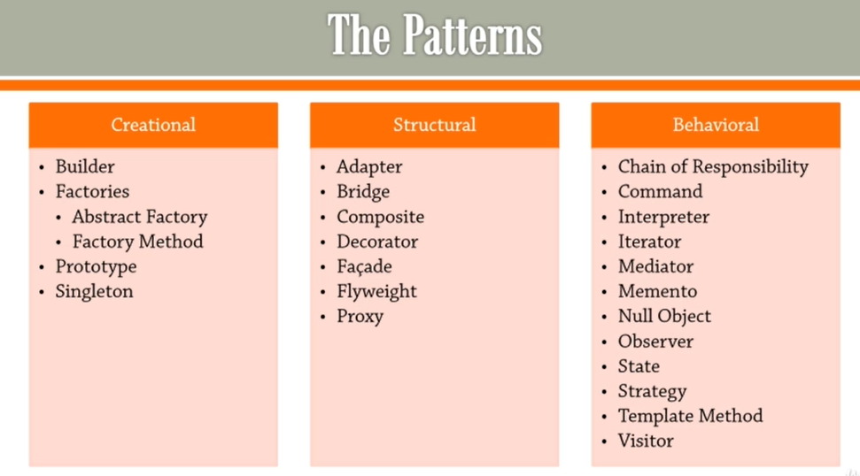

(https://nitinkc.github.io/java/SOLID-principles/)[https://nitinkc.github.io/java/SOLID-principles/]

## Pillars of Code Quality

* Testability
* Maintainability - Extendable, Enhanceable
* Readability - Code is written to be read by others or yourself.
